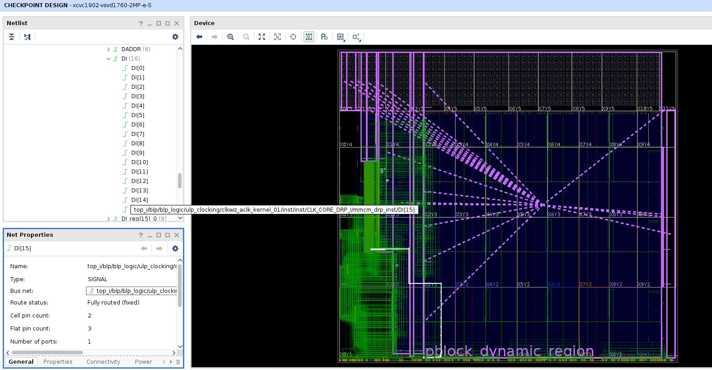
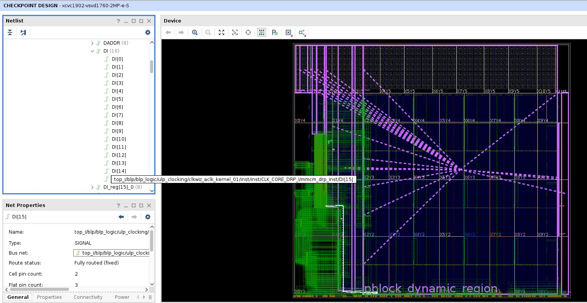

# Spatially Distributed Ensemble of Sockets (SPADES)

**A Modular, Composable, and Reusable Hardware Design Method for Versal Programmable Logic**

Documentation in-progress

## Prerequisites

- **Accelerator card**: AMD VCK5000
- **Base platform**: xilinx_vck5000_gen4x8_qdma_2_202220_1
- **Vitis/Vivado**: 2022.2
- **XRT**: 2.14.384 (2022.2)
- **Linux kernel**: 5.4.0-42-generic
- **RapidWright**: 2023.1.4
- **Development OS**: Ubuntu 20.04
- **Additional software**: RISC-V GCC toolchain (prebuilt binaries from SiFive), iverilog

## Project components

- **benchmarks/**: contains the benchmarks for the project.

    - **hls\_kernel/**: HLS design for socket custom compute logic.

    - **host\_sw/**: Host program for programming and running a benchmark on VCK5000.

- **checkpoints/**: contains the checkpoints (DCP) files read or generated by various flows
of the project (Vivado/RapidWright).

- **controller_software/**: contains the software programs for the softcore (RISC-V 32b) of
a socket.

- **pdi_gen/**: contains the PDI generation flow. The input is full\_design.{benchmark}.dcp
generated by RapidWright SpadesFlow.

- **rapidwright/**: install RapidWright here.

- **rtl/**: contains the socket RTL design + simulation.

- **scripts/**: contains the scripts to generate custom logic components of a socket (memory
and compute)

- **socket_cc_flow/**: contains the Socket Communication & Control flow (fixed, reusable across benchmarks).

- **socket_cl_flow/**: contains the Socket Custom Logic flow.

- **standalone_flow/**: contains the standalone flow (Socket CC and CL compiled as a whole).

- **ulp_design/**: contains the ULP design flow for shell + user_static logic (socket manager) implementation.
It also supports implementing a socket design project in top-down mode.

- **platform_xsabin_gen/**: for generating new platform xsabin file compatible to this project.

## General Setup

Some files require absolute path to this repository. Set the path in set\_path.sh
and run the script to update them.

```
./set_path.sh
```
## Modified VCK5000 Shell

Note that the bitstream generated by this project might not work with systems that
install the vanilla shell obtained from AMD Xilinx member site. The original
shell is incompatible to this project since there are some wires from the shell utility logic
crossing the fabric region reserved for socket modules (socket region) described in this flow.
**The range of the socket region is INT_X29Y4 to INT_X112Y331**.
The following screenshots show the original shell with a violating wire crossing the socket region,
and the modified shell in which the wire got rerouted.
This would require us to generate a new xsabin contain the configuration data of the implementation of the modified shell.
Attempt to download any bitstream files generated by this project may hang the system unless it is updated
with the new xsabin.

 *Original shell*
 *Modified shell*

The compatible shell checkpoint (used in this project) is available in the SPADES assets.
`spades_assets/ulp_design/utils/xilinx_vck5000_gen4x8_qdma_2_202220_1_bb_locked.dcp`

Follow the instructions in [platform_xsabin_gen/README.md](https://github.com/nqdtan/spades/tree/master/platform_xsabin_gen)
to obtain a xsabin file implemented with the compatible shell checkpoint.

## Example of how to run benchmark matmul (step-by-step)

```
# Generate compute logic RTL using Vitis HLS
cd spades/benchmarks/hls_kernel
vitis_hls run_hls.tcl matmul cl_matmul

# Generate RTL wrappers for matmul custom logic and memory logic
# The memory logic config is defined at spades/scripts/benchmark_config.py
./run_cl_lsu_rg_gen.sh matmul

# Run RTL simulation (iverilog) with problem size 128
# 49152 = 3x128x128 (A, B, C) is the length of test data 
cd spades/rtl
./run_ivsim_socket_top.sh matmul 49152


# Run Socket CC (Communication & Control) flow to implement the fixed component
# of a socket. This only needs to run once for all benchmarks. The output files
# are socket_cc.dcp + socket_cc.edf in spades/checkpoints
cd spades/socket_cc_flow
./run_flow.sh

# Extract ff_bridge cells implemented in Socket CC. This will generate
# ff_bridge_extracted.dcp in spades/checkpoints. This file will later be used in
# socket_cl flow.
cd spades/rapidwright
./run_rw.sh FFBridgeExtract
cd spades/checkpoints
vivado -mode batch -source lock_design_ff_bridge_fixed.tcl
cp spades/checkpoints/ff_bridge_extracted_fixed.dcp socket_cc_flow/ff_bridge/ff_bridge_extracted_fixed.dcp

# Run Socket CL (Custom Logic) flow to implement the CL component of a socket.
# The output files are socket_rg_cl.matmul.dcp + socket_rg_cl.matmul.edf in
# spades/checkpoints
cd spades/socket_cl_flow
./run_flow.sh matmul

# Remove cells (of ff_bridge) in socket_rg_cl checkpoint to ensure compatibility
# with socket_cc checkpoint during SocketStitch
cd spades/checkpoints
cp socket_rg_cl.matmul.dcp socket_rg_cl.dcp
cp socket_rg_cl.matmul.edf socket_rg_cl.edf
vivado -mode batch -source remove_stub_cells.tcl

# Run SocketStitch to combine Socket CC and Socket CL. The output is
# spades/checkpoints/socket_rw_full_v0.dcp
cd spades/rapidwright
./run_rw.sh SocketStitch

# Run SpadesFlow to produce full design checkpoint contain 9 sockets. The output
# is spades/checkpoints/full_design.dcp
cd spades/rapidwright
./run_rw.sh SpadesFlow spades_config/9_socket_m.json

# Run PDI generation flow to obtain PDI file
cd spades/checkpoints
cp full_design.dcp full_design.matmul.dcp
cd spades/pdi_gen
./run_flow.sh matmul

# Generate xclbin file for programming VCK5000. The operating frequency is configurable.
# In this example, it is set to 2.05ns (or 1000/2.05 = 487MHz)
cp spades/pdi_gen/project_pdi_gen_matmul_{timestamp)}/*.pdi spades/ulp_design/xclbin_generator
cd spades/ulp_design/xclbin_generator
./xclbin_gen.sh 205

# The following steps show how to download the bitstream to VCK5000 and run the host program.
# Make sure the card is installed properly as instructed by the user guides (UG1428, UG1531)

cd spades/controller_software
# This will generate instructional memory data for one socket with problem size 512x512.
# The output will be generated at spades/benchmarks/host_sw/matmul/control_top.h
./generate_socket_imem.sh matmul 1 512 
cd spades/benchmarks/host_sw
cp spades/ulp_design/xclbin_generator/ulp.xclbin ./
make app=matmul
# This need to run twice to make sure socket_manager read and write states are
# init to IDLE (FIXME (nqdtan)). This program also reset the BUFDIV cells in socket
# regions to ensure that the clock divide factor takes effect
./reset_bufdiv.exe
./reset_bufdiv.exe
# Run the host program. Make sure to change the problem size defined in matmul/host.cpp
# to 512 ("#define MATDIM 512" in line 13)
./app.exe

# To rerun the program with 9 sockets and problem size 1024x1024
cd spades/controller_software
./generate_socket_imem.sh matmul 9 1024
cd spades/benchmarks/host_sw
# Edit line 13 in matmul/host.cpp to "#define MATDIM 1024"
make app=matmul
./app.exe

```

## Assets

Several Vivado design checkpoints (shell, benchmark designs, etc.) and xclbin files generated by the project
are archived [here](https://drive.google.com/file/d/1ISzVNuS8aGjdHm_ZrEiqqLnOjyjxvKvZ/view?usp=sharing).

